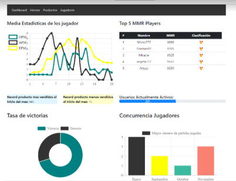

# Simple dashboard maked in php mssql and chartjs



## Make a canvas object on html
``` html
<canvas id="Chart" ></canvas>
```

## Get the data from mssql with php

``` php
 $consulta = "SELECT minuto, avg(epm) as m_epm, avg(opm) as m_opm, AVG(apm) m_apm  from desc_partida group by minuto ";
                $sql = sqlsrv_query($con, $consulta);
              
                while($row = sqlsrv_fetch_array($sql)){
                $minuto	= $row['minuto'];
                            $epm = $row['m_epm'];
                            $opm = $row['m_opm'];
                            $apm = $row['m_apm'];
                    
                    $tiempos = $tiempos.$minuto.',';
                            $experiencias = $experiencias.$epm.',';
                            $oros = $oros.$opm.',';
                            $acciones = $acciones.$apm.',';
                }
                $tiempos = trim($tiempos,",");
                        $experiencias = trim($experiencias,",");
                        $oros = trim($oros,",");
                        $acciones = trim($acciones,",");
```
## Call the canvas in js and set the data to the dataset Object 

``` javascript

    var ctx = document.getElementById("Chart");
    
    var data = {
      datasets: [
        
      {
        data: [<?php echo $oros; ?>],
        backgroundColor: 'transparent'
        borderColor: "teal",
        borderWidth: 5,
        label: 'OPM'
      },
      
      {
        data: [<?php echo $acciones; ?>],
        backgroundColor: 'transparent',
        borderColor: "#333",
        borderWidth: 5,
        label: 'APM'
      },
   
      
      {
        data: [<?php echo $experiencias; ?>],
        backgroundColor: 'transparent',
        borderColor: "yellow",
        borderWidth: 5,
        label: 'EPM'
      }
 
      
      ],
      
      // important this the x axis
      labels: [
        <?php echo $tiempos; ?>
      ]
    };

